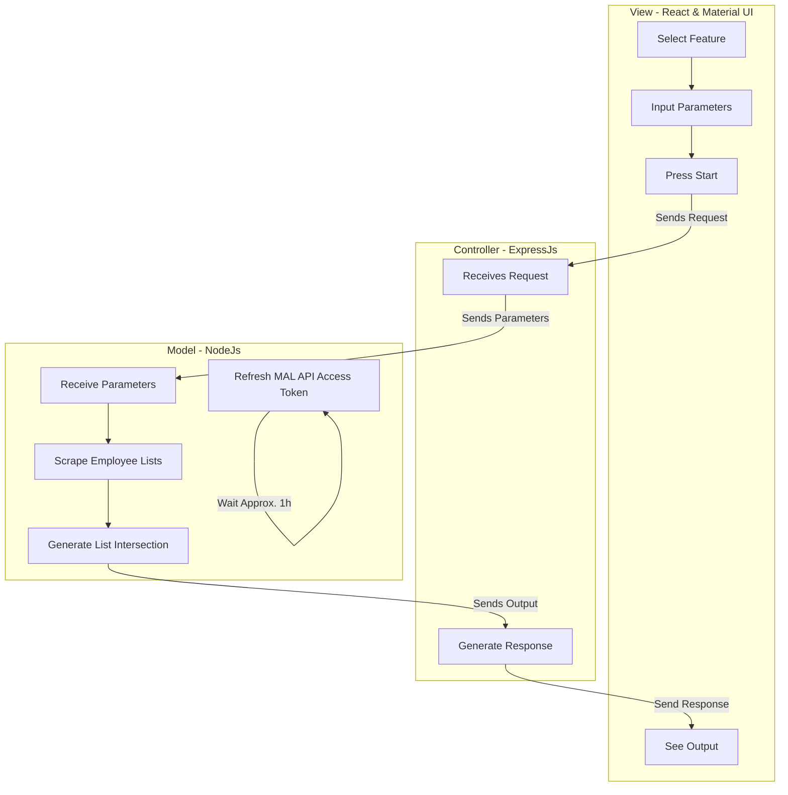

# MyAnimeList.net Statistics Figures - Design Document

## Purpose
This is a web-app that looks at a given public myanimelist.net anime list and calculates/displays several interesting statistics and displays them in a data visualization. 

#### Input
* A url to a public MAL animelist
* Integers for inclusive [low, high] range scores
* Integer for shows worked on for a given staff member to be considered a "liked member".
  
#### Output
* List of employees
  * Role(s)
  * Name
  * MAL profile
  * Number of relevant shows worked on

* List of voice actors
  * Name
  * MAL profile
  * Relevent characters portrayed

## Dependencies 
Note: All code instructions are assumed to be ran from root of repo
* express
  * provides lots of handy methods for creating a web service
  * `npm install express`

* express-validator 
  * a wrapper for npm's validate.js that allows for custom validators and better-organized error handling
  * `npm install --save express-validator`

* dotenv
  * helps load environment variables into the service
  * used for some MAL API secrets
  * `npm install dotenv`

* axios
  * a web client
  * to be used by react front-end to make requests to back end
  * to be used by express back-end to make requests to MAL API
  * `npm install axios`
  * `cd client`
  * `npm install axios`

* nodemon
  * allows for the front-end client to update when changes are saved. this means that you don't need to manually restart and wait between changes
  * `npm install nodemon --save-dev`

* concurrently
  * allows for running commands simultaneously from one terminal
  * `npm install concurrently`
  
* react-router-dom
  * helps for building single-page applications
  * `cd client`
  * `npm i react-router-dom --save`
  
## Design
Note: Diagrams made with https://mermaid-js.github.io/mermaid/#/

## Dev Notes
* proxy field in the package.json within client folder to be changed in the future