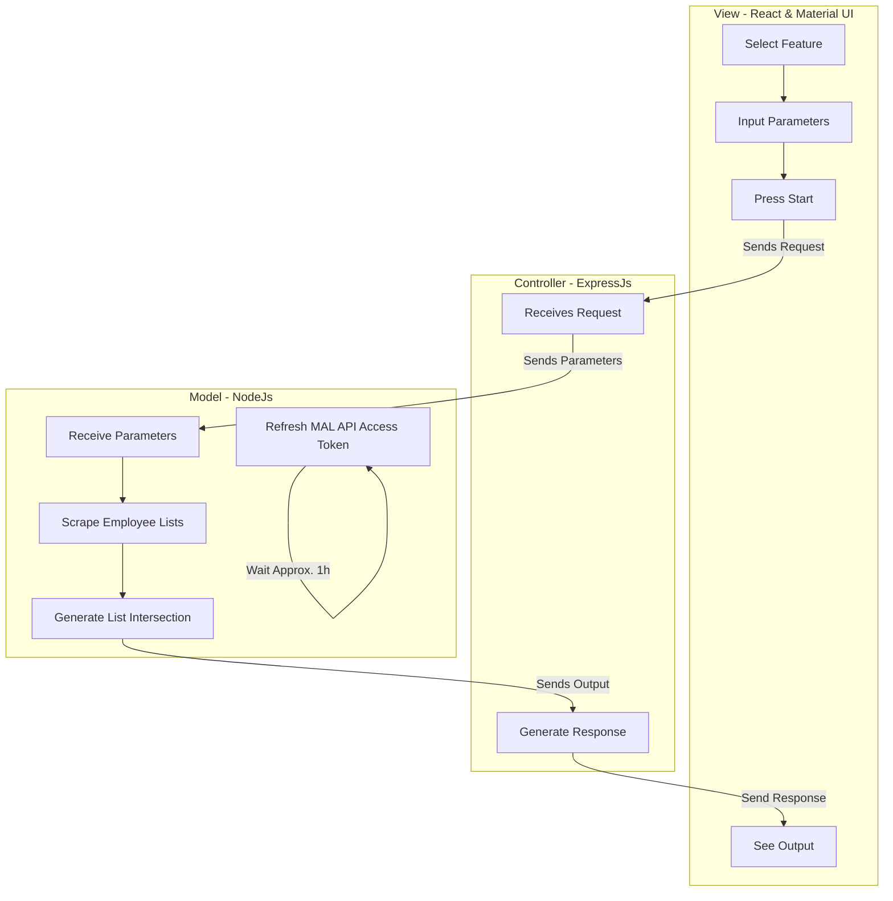

# MyAnimeList.net Statistics Figures - Design Document

## Purpose
This is a web-app that looks at a given public myanimelist.net anime list and calculates/displays several interesting statistics and displays them in a data visualization. 
  
## Setup
* have node.js installed
* clone repo
* install dependencies (additional ones listed below)
  * should only need to do `npm install concurrently` and `npm install react` which **should** take care of the other dependencies...
* create .env file containing an `ACCESS_TOKEN` variable containing your MAL API access token. To generate one, follow the instructions here: https://myanimelist.net/blog.php?eid=835707
* `npm run dev`

## Completed Features
* Common Studios
  * From a given MAL user's animelist, get the names of the studios responsible for at least X # of anime within a given score range of the animelist

## Planned Features
* 'Trash Taste' Factor
  * Looks at the completed anime of a given list and uses euclidean distance to determine how 'close' a user's anime scores are to the average found on MAL

* User Similarity
  * Similarly to the trash taste factor, scores between sets of anime are compared but instead of comparing a user to the average, a user is compared to another user.

* Common Employees
  * Similarly to common studios, this shows the employees and their respective roles behind the anime enjoyed by the user. 

## Dependencies 
Note: All code instructions are assumed to be ran from root of repo
* express
  * provides lots of handy methods for creating a web service
  * `npm install express`

* express-validator 
  * a wrapper for npm's validate.js that allows for custom validators and better-organized error handling
  * `npm install --save express-validator`

* dotenv
  * helps load environment variables into the service
  * used for some MAL API secrets
  * `npm install dotenv`

* axios
  * a web client
  * to be used by react front-end to make requests to back end
  * to be used by express back-end to make requests to MAL API
  * `npm install axios`
  * `cd client`
  * `npm install axios`

* nodemon
  * allows for the front-end client to update when changes are saved. this means that you don't need to manually restart and wait between changes
  * `npm install nodemon --save-dev`

* concurrently
  * allows for running commands simultaneously from one terminal
  * `npm install concurrently --save`
  
* react-router-dom
  * helps for building single-page applications
  * `cd client`
  * `npm i react-router-dom --save`

* nivo
  * react library used for graphical data representation
  * lots of neat examples on the [website](https://nivo.rocks/)
  * `yarn add @nivo/core @nivo/bar`
  
## Design
Note: Diagrams made with https://mermaid-js.github.io/mermaid/#/

## Dev Notes
* proxy field in the package.json within client folder to be changed in the future
