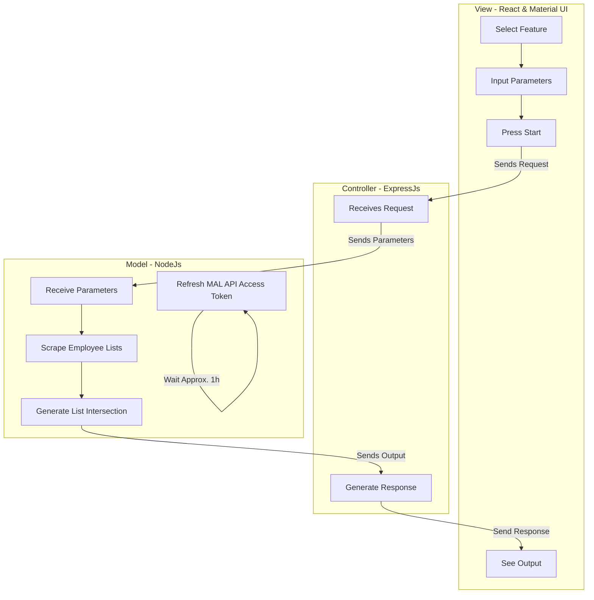

# MyAnimeList.net Staff Tracker - Design Document

## Purpose
This is a web-app that looks at a given myanimelist.net user's anime list 
and analyses the listed shows within a given rating range and compiles a list of staff
that have worked on those shows. The staff listed is determined by an integer input
for the number of shows worked on for a given staff member.

The web-app will be designed such that new features are modular and easily added. 
In the future, I want this web-app to be home to several stat tracking apps for a myanimelist.net user.

#### Input
* A myanimelist.net username
* Integers for inclusive [low, high] range scores
* Integer for shows worked on for a given staff member to be considered a "liked member".
  
#### Output
* List of employees
  * Role(s)
  * Name
  * MAL profile
  * Number of relevant shows worked on

* List of voice actors
  * Name
  * MAL profile
  * Relevent characters portrayed

## Dependencies 
* express
  * provides lots of handy methods for creating a web service
  * `npm install express`

* express-validator 
  * a wrapper for npm's validate.js that allows for custom validators and better-organized error handling
  * `npm install --save express-validator`

* axios
  * a web client
  * to be used with react front-end interact with backend api
  * to be used by backend to make requests to MAL (myanimelist) api
  * `npm install axios`
  * `cd client`
  * `npm install axios`
  
* dotenv
  * for loading environmental variables from env.json

## Design
Note: Diagrams made with https://mermaid-js.github.io/mermaid/#/

