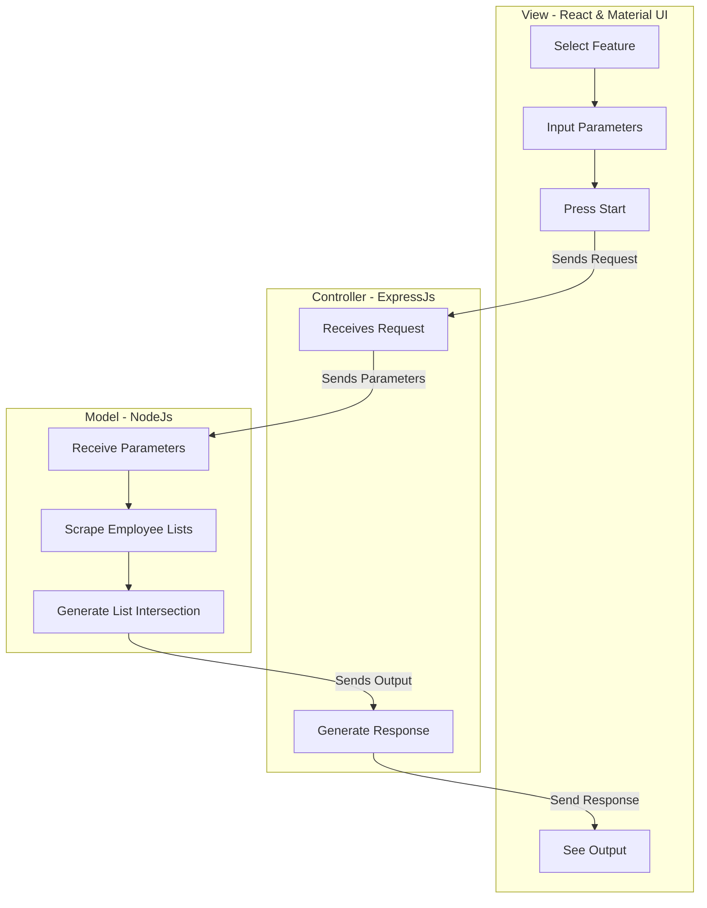

# MyAnimeList.net Staff Tracker - Design Document

## Purpose
This is a web-scraping web-app that looks at a given public myanimelist.net anime list 
and looks at the listed shows within a given rating range and compiles a list of staff
that have worked on those shows. The staff listed is determined by an integer input
for the number of shows worked on for a given staff member. 

#### Input
* A url to a public MAL animelist
* Integers for inclusive [low, high] range scores
* Integer for shows worked on for a given staff member to be considered a "liked member".
  
#### Output
* List of employees
  * Role(s)
  * Name
  * MAL profile
  * Number of relevant shows worked on

* List of voice actors
  * Name
  * MAL profile
  * Relevent characters portrayed

## Design
Note: Diagrams made with https://mermaid-js.github.io/mermaid/#/

